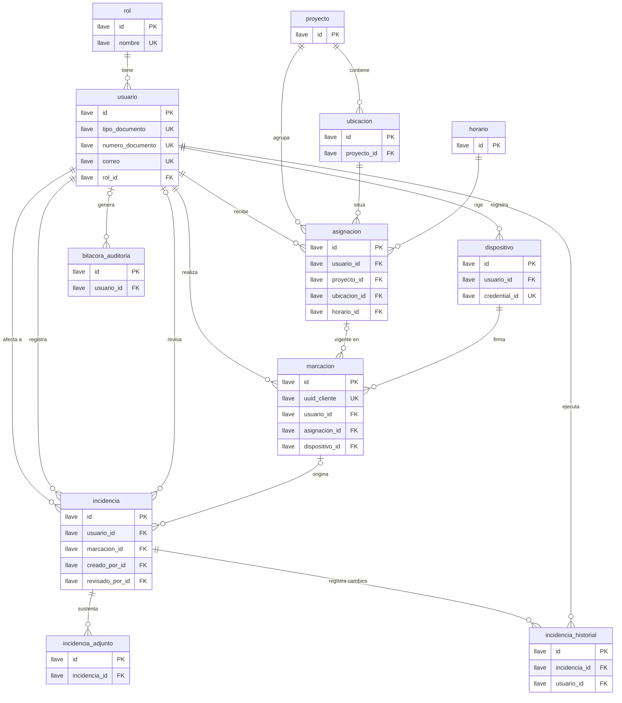
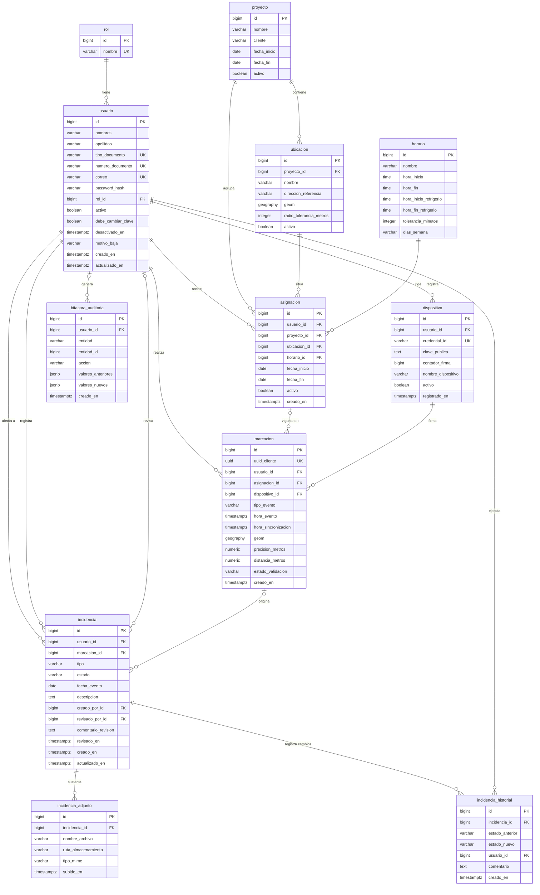

# Base de datos — modelo lógico, físico y diccionario de datos

> Cap. V 5.2 del informe (APF2) · Anexo B. Documento generado a partir del esquema real aplicado por Flyway (`V1__esquema_inicial.sql`, `V2__restricciones_e_indices.sql`, `V3__usuarios_estado_cuenta.sql` y `V4__asignaciones_varias_sedes.sql`), por lo que coincide con lo implementado. Si cambia el esquema, hay que regenerarlo.

**Motor:** PostgreSQL 16 con PostGIS 3.4 · **Migraciones:** Flyway (`backend/src/main/resources/db/migration`) · **Tablas:** 12 · **Relaciones:** 18.

## 1. Convenciones

- Todo se nombra en español y en minúsculas con guion bajo (`usuario_id`, `hora_evento`).
- Llaves primarias `id BIGSERIAL`; llaves foráneas `<entidad>_id`.
- Las marcas de tiempo son `TIMESTAMPTZ` (se guardan en UTC); las fechas sin hora, `DATE`.
- La geolocalización usa `geography(Point, 4326)` para que las distancias se calculen en metros sobre el elipsoide.
- Las bajas son lógicas (`activo`): se conserva el historial y no se borra información auditable.
- Los dominios cerrados (estados, tipos) son `VARCHAR` con restricción `CHECK` que espeja el enum Java; no se usan tipos `ENUM` de Postgres para poder evolucionar con migraciones simples.

## 2. Modelo lógico

Entidades, llaves y cardinalidades, sin tipos de dato. Se lee: «un rol **tiene** cero o muchos usuarios».



Lectura de las cardinalidades menos obvias:

- `incidencia` apunta tres veces a `usuario`: el colaborador **afectado** (`usuario_id`), quien la **registró** (`creado_por_id`) y quien la **revisó** (`revisado_por_id`, opcional hasta la revisión).
- `marcacion.asignacion_id` es opcional: una marcación sin asignación vigente se guarda igual con estado `SIN_ASIGNACION` para no perder el evento.
- `incidencia.marcacion_id` es opcional: hay incidencias (p. ej. una ausencia) que no nacen de una marcación.

## 3. Modelo físico

Con el tipo base de cada columna (longitudes y valores por defecto, en el diccionario de la sección 4).



## 4. Diccionario de datos

**Clave:** PK = llave primaria · FK → tabla = llave foránea · UQ = valor único · Nulo = admite `NULL`.

### `asignacion`

Vínculo versionado en el tiempo colaborador–proyecto–ubicación–horario.

| Columna | Tipo | Nulo | Por defecto | Clave | Descripción |
|---|---|---|---|---|---|
| `id` | `bigint` | No | `serial` | PK | Identificador de la asignación. |
| `usuario_id` | `bigint` | No |  | FK → `usuario` | Colaborador asignado. |
| `proyecto_id` | `bigint` | No |  | FK → `proyecto` | Proyecto de la asignación. |
| `ubicacion_id` | `bigint` | No |  | FK → `ubicacion` | Ubicación donde trabaja. |
| `horario_id` | `bigint` | No |  | FK → `horario` | Horario que cumple. |
| `fecha_inicio` | `date` | No |  |  | Primer día de vigencia (inclusivo). |
| `fecha_fin` | `date` | Sí |  |  | Último día de vigencia (inclusivo); nulo si no tiene fin. |
| `activo` | `boolean` | No | `true` |  | Falso si fue anulada; las anuladas no cuentan para el solapamiento. |
| `creado_en` | `timestamp with time zone` | No | `now()` |  | Fecha y hora de creación. |

### `bitacora_auditoria`

Auditoría general: quién modificó qué entidad y con qué valores.

| Columna | Tipo | Nulo | Por defecto | Clave | Descripción |
|---|---|---|---|---|---|
| `id` | `bigint` | No | `serial` | PK | Identificador del registro. |
| `usuario_id` | `bigint` | Sí |  | FK → `usuario` | Usuario que actuó; nulo si fue el sistema. |
| `entidad` | `varchar(100)` | No |  |  | Nombre de la entidad modificada. |
| `entidad_id` | `bigint` | No |  |  | Identificador del registro modificado. |
| `accion` | `varchar(30)` | No |  |  | CREACION, MODIFICACION o ELIMINACION. |
| `valores_anteriores` | `jsonb` | Sí |  |  | Estado previo en JSON; nulo en la creación. |
| `valores_nuevos` | `jsonb` | Sí |  |  | Estado resultante en JSON. |
| `creado_en` | `timestamp with time zone` | No | `now()` |  | Fecha y hora de la acción. |

### `dispositivo`

Dispositivo autorizado de un usuario. Guarda la clave pública de su credencial WebAuthn; nunca una plantilla biométrica.

| Columna | Tipo | Nulo | Por defecto | Clave | Descripción |
|---|---|---|---|---|---|
| `id` | `bigint` | No | `serial` | PK | Identificador del dispositivo. |
| `usuario_id` | `bigint` | No |  | FK → `usuario` | Usuario dueño del dispositivo. |
| `credential_id` | `varchar(255)` | No |  | UQ | Identificador de la credencial WebAuthn; único en todo el sistema. |
| `clave_publica` | `text` | No |  |  | Clave pública con la que se valida la firma de cada marcación. |
| `contador_firma` | `bigint` | No | `0` |  | Contador de firmas WebAuthn; detecta credenciales clonadas. No negativo. |
| `nombre_dispositivo` | `varchar(100)` | Sí |  |  | Nombre descriptivo (p. ej. modelo del teléfono). |
| `activo` | `boolean` | No | `true` |  | Falso cuando el dispositivo fue revocado. |
| `registrado_en` | `timestamp with time zone` | No | `now()` |  | Fecha y hora del registro del dispositivo. |

### `horario`

Turno de trabajo: jornada, refrigerio y tolerancia de puntualidad.

| Columna | Tipo | Nulo | Por defecto | Clave | Descripción |
|---|---|---|---|---|---|
| `id` | `bigint` | No | `serial` | PK | Identificador del horario. |
| `nombre` | `varchar(100)` | No |  |  | Nombre del turno. |
| `hora_inicio` | `time without time zone` | No |  |  | Hora de inicio de la jornada. |
| `hora_fin` | `time without time zone` | No |  |  | Hora de fin; debe ser posterior al inicio. |
| `hora_inicio_refrigerio` | `time without time zone` | Sí |  |  | Inicio del refrigerio; nulo si no hay. |
| `hora_fin_refrigerio` | `time without time zone` | Sí |  |  | Fin del refrigerio; se define junto con el inicio y dentro de la jornada. |
| `tolerancia_minutos` | `integer` | No | `10` |  | Minutos de gracia de puntualidad; no negativo. |
| `dias_semana` | `varchar(20)` | No | `L,M,X,J,V` |  | Días laborables separados por coma (L,M,X,J,V,…). |

### `incidencia`

Incidencia laboral (tardanza, ausencia, permiso…) que sigue el flujo Registrada → En revisión → Aprobada/Rechazada → Cerrada.

| Columna | Tipo | Nulo | Por defecto | Clave | Descripción |
|---|---|---|---|---|---|
| `id` | `bigint` | No | `serial` | PK | Identificador de la incidencia. |
| `usuario_id` | `bigint` | No |  | FK → `usuario` | Colaborador afectado por la incidencia. |
| `marcacion_id` | `bigint` | Sí |  | FK → `marcacion` | Marcación que la originó, si aplica. |
| `tipo` | `varchar(30)` | No |  |  | TARDANZA, AUSENCIA, OLVIDO_REGISTRO, PERMISO o JUSTIFICACION. |
| `estado` | `varchar(30)` | No | `REGISTRADA` |  | REGISTRADA, EN_REVISION, APROBADA, RECHAZADA o CERRADA. |
| `fecha_evento` | `date` | No |  |  | Día al que corresponde la incidencia. |
| `descripcion` | `text` | No |  |  | Relato o justificación. |
| `creado_por_id` | `bigint` | No |  | FK → `usuario` | Usuario que registró la incidencia. |
| `revisado_por_id` | `bigint` | Sí |  | FK → `usuario` | Usuario que la revisó; nulo mientras no se revise. |
| `comentario_revision` | `text` | Sí |  |  | Comentario del revisor. |
| `revisado_en` | `timestamp with time zone` | Sí |  |  | Cuándo se revisó; nulo exactamente cuando no hay revisor. |
| `creado_en` | `timestamp with time zone` | No | `now()` |  | Fecha y hora de registro. |
| `actualizado_en` | `timestamp with time zone` | No | `now()` |  | Fecha y hora de la última modificación. |

### `incidencia_adjunto`

Sustento documental de una incidencia. Solo se guarda la ruta del archivo.

| Columna | Tipo | Nulo | Por defecto | Clave | Descripción |
|---|---|---|---|---|---|
| `id` | `bigint` | No | `serial` | PK | Identificador del adjunto. |
| `incidencia_id` | `bigint` | No |  | FK → `incidencia` | Incidencia a la que sustenta. |
| `nombre_archivo` | `varchar(255)` | No |  |  | Nombre original del archivo. |
| `ruta_almacenamiento` | `varchar(500)` | No |  |  | Ruta del archivo en el volumen del backend; el archivo no vive en la base. |
| `tipo_mime` | `varchar(100)` | No |  |  | Tipo MIME del archivo. |
| `subido_en` | `timestamp with time zone` | No | `now()` |  | Fecha y hora de la subida. |

### `incidencia_historial`

Bitácora de cada cambio de estado de una incidencia.

| Columna | Tipo | Nulo | Por defecto | Clave | Descripción |
|---|---|---|---|---|---|
| `id` | `bigint` | No | `serial` | PK | Identificador del registro. |
| `incidencia_id` | `bigint` | No |  | FK → `incidencia` | Incidencia que cambió de estado. |
| `estado_anterior` | `varchar(30)` | Sí |  |  | Estado previo; nulo en el alta. |
| `estado_nuevo` | `varchar(30)` | No |  |  | Estado al que pasó. |
| `usuario_id` | `bigint` | No |  | FK → `usuario` | Usuario que hizo el cambio. |
| `comentario` | `text` | Sí |  |  | Motivo o comentario del cambio. |
| `creado_en` | `timestamp with time zone` | No | `now()` |  | Fecha y hora del cambio. |

### `marcacion`

Evento de asistencia (entrada, refrigerio, salida) con su geolocalización y el resultado de la validación contextual.

| Columna | Tipo | Nulo | Por defecto | Clave | Descripción |
|---|---|---|---|---|---|
| `id` | `bigint` | No | `serial` | PK | Identificador de la marcación. |
| `uuid_cliente` | `uuid` | No |  | UQ | UUID generado en el dispositivo al capturar el evento; deduplica reintentos de sincronización. |
| `usuario_id` | `bigint` | No |  | FK → `usuario` | Colaborador que marca. |
| `asignacion_id` | `bigint` | Sí |  | FK → `asignacion` | Asignación vigente al momento del evento; nulo si no había (SIN_ASIGNACION). |
| `dispositivo_id` | `bigint` | No |  | FK → `dispositivo` | Dispositivo que firmó la marcación. |
| `tipo_evento` | `varchar(30)` | No |  |  | ENTRADA, INICIO_REFRIGERIO, FIN_REFRIGERIO o SALIDA. |
| `hora_evento` | `timestamp with time zone` | No |  |  | Cuándo ocurrió el evento (hora del dispositivo). |
| `hora_sincronizacion` | `timestamp with time zone` | No | `now()` |  | Cuándo llegó al servidor; difiere de hora_evento en operación offline. |
| `geom` | `geography` | No |  |  | Posición reportada por el dispositivo (geography, SRID 4326). |
| `precision_metros` | `numeric(10,2)` | Sí |  |  | Precisión del GPS reportada; no negativa. |
| `distancia_metros` | `numeric(10,2)` | Sí |  |  | Distancia calculada a la ubicación asignada; no negativa. |
| `estado_validacion` | `varchar(30)` | No |  |  | Resultado graduado: VALIDO, OBSERVADO, FUERA_DE_TOLERANCIA, SOSPECHOSO o SIN_ASIGNACION. |
| `creado_en` | `timestamp with time zone` | No | `now()` |  | Fecha y hora de registro en el servidor. |

### `proyecto`

Servicio o cliente al que se asigna personal de campo.

| Columna | Tipo | Nulo | Por defecto | Clave | Descripción |
|---|---|---|---|---|---|
| `id` | `bigint` | No | `serial` | PK | Identificador del proyecto. |
| `nombre` | `varchar(150)` | No |  |  | Nombre del proyecto. |
| `cliente` | `varchar(150)` | No |  |  | Cliente o área a la que se presta el servicio. |
| `fecha_inicio` | `date` | No |  |  | Fecha de inicio del proyecto. |
| `fecha_fin` | `date` | Sí |  |  | Fecha de fin; nula si sigue abierto. No puede ser anterior al inicio. |
| `activo` | `boolean` | No | `true` |  | Baja lógica del proyecto. |

### `rol`

Catálogo cerrado de roles del sistema (COLABORADOR, SUPERVISOR, RRHH_ADMIN).

| Columna | Tipo | Nulo | Por defecto | Clave | Descripción |
|---|---|---|---|---|---|
| `id` | `bigint` | No | `serial` | PK | Identificador del rol. |
| `nombre` | `varchar(30)` | No |  | UQ | Nombre del rol; solo admite COLABORADOR, SUPERVISOR o RRHH_ADMIN. |

### `ubicacion`

Sede o frente de trabajo de un proyecto, con su punto geográfico y radio de tolerancia.

| Columna | Tipo | Nulo | Por defecto | Clave | Descripción |
|---|---|---|---|---|---|
| `id` | `bigint` | No | `serial` | PK | Identificador de la ubicación. |
| `proyecto_id` | `bigint` | No |  | FK → `proyecto` | Proyecto al que pertenece la ubicación. |
| `nombre` | `varchar(150)` | No |  |  | Nombre de la sede o frente. |
| `direccion_referencia` | `varchar(255)` | Sí |  |  | Dirección o referencia textual opcional. |
| `geom` | `geography` | No |  |  | Punto geográfico (PostGIS geography, SRID 4326). |
| `radio_tolerancia_metros` | `integer` | No | `150` |  | Margen en metros que usa el motor de validación; debe ser mayor que cero. |
| `activo` | `boolean` | No | `true` |  | Baja lógica de la ubicación. |

### `usuario`

Persona que usa el sistema. Solo SUPERVISOR y RRHH_ADMIN tienen contraseña; el COLABORADOR se autentica con biometría delegada al dispositivo.

| Columna | Tipo | Nulo | Por defecto | Clave | Descripción |
|---|---|---|---|---|---|
| `id` | `bigint` | No | `serial` | PK | Identificador del usuario. |
| `nombres` | `varchar(100)` | No |  |  | Nombres de la persona. |
| `apellidos` | `varchar(100)` | No |  |  | Apellidos de la persona. |
| `tipo_documento` | `varchar(20)` | No |  | UQ (compuesto) | Tipo de documento de identidad (texto libre, p. ej. DNI). |
| `numero_documento` | `varchar(20)` | No |  | UQ (compuesto) | Número del documento; único junto con el tipo. |
| `correo` | `varchar(150)` | No |  | UQ | Correo electrónico; se guarda en minúsculas y es único sin distinguir mayúsculas (`uk_usuario_correo_minusculas`, V3). Se usa como identificador de acceso. |
| `password_hash` | `varchar(255)` | Sí |  |  | Hash bcrypt de la contraseña. Nulo para colaboradores. |
| `rol_id` | `bigint` | No |  | FK → `rol` | Rol asignado al usuario. |
| `activo` | `boolean` | No | `true` |  | Baja lógica: falso impide el acceso sin borrar el historial. |
| `debe_cambiar_clave` | `boolean` | No | `false` |  | Verdadero tras un restablecimiento por el administrador: el usuario solo puede cambiar su clave (V3). |
| `desactivado_en` | `timestamp with time zone` | Sí |  |  | Fecha y hora de la baja; nulo mientras la cuenta está activa (V3). |
| `motivo_baja` | `varchar(255)` | Sí |  |  | Motivo opcional de la baja (V3). |
| `creado_en` | `timestamp with time zone` | No | `now()` |  | Fecha y hora de alta. |
| `actualizado_en` | `timestamp with time zone` | No | `now()` |  | Fecha y hora de la última modificación. |

## 5. Restricciones de integridad (migraciones V2 y V4)

Son la última línea de defensa: actúan aunque falle un servicio o alguien escriba directo en la base. Cada una tiene su prueba en `RestriccionesBaseDatosTest`.

| Tabla | Restricción | Regla |
|---|---|---|
| `marcacion` | `ck_marcacion_tipo_evento, ck_marcacion_estado_validacion` | Solo valores de los enums `TipoEvento` y `EstadoValidacion`. |
| `marcacion` | `ck_marcacion_precision_no_negativa, ck_marcacion_distancia_no_negativa` | Precisión y distancia, si existen, no son negativas. |
| `incidencia` | `ck_incidencia_tipo, ck_incidencia_estado` | Solo valores de `TipoIncidencia` y `EstadoIncidencia`. |
| `incidencia` | `ck_incidencia_revision_completa` | `revisado_por_id` y `revisado_en` van juntos: ambos nulos o ambos con valor. |
| `incidencia_historial` | `ck_incidencia_historial_estado_anterior, ck_incidencia_historial_estado_nuevo` | Los estados registrados pertenecen al dominio de `EstadoIncidencia`. |
| `bitacora_auditoria` | `ck_bitacora_accion` | Solo `CREACION`, `MODIFICACION` o `ELIMINACION`. |
| `rol` | `ck_rol_nombre` | Solo `COLABORADOR`, `SUPERVISOR` o `RRHH_ADMIN`. |
| `proyecto` | `ck_proyecto_fechas` | `fecha_fin` no puede ser anterior a `fecha_inicio`. |
| `ubicacion` | `ck_ubicacion_radio_positivo` | El radio de tolerancia es mayor que cero. |
| `horario` | `ck_horario_jornada` | `hora_fin` es posterior a `hora_inicio`. |
| `horario` | `ck_horario_tolerancia` | La tolerancia no es negativa. |
| `horario` | `ck_horario_refrigerio` | El refrigerio se define completo o no se define, y cae dentro de la jornada. |
| `asignacion` | `ck_asignacion_fechas` | `fecha_fin` no puede ser anterior a `fecha_inicio`. |
| `asignacion` | `ex_asignacion_misma_sede_sin_solapamiento` (V4) | Un colaborador no puede tener la **misma sede** dos veces entre las asignaciones activas con fechas solapadas (rango inclusivo; sin `fecha_fin` = sin fin). Sedes distintas sí pueden coexistir. Usa `btree_gist`. Reemplaza a `ex_asignacion_sin_solapamiento` de V2, que prohibía cualquier solapamiento por colaborador. |
| `dispositivo` | `ck_dispositivo_contador` | El contador de firmas no es negativo. |

## 6. Índices

Además de los índices de las llaves primarias y de las restricciones únicas:

| Índice | Tabla (columnas) | Para qué |
|---|---|---|
| `idx_dispositivo_usuario` | dispositivo (usuario_id) | Dispositivos de un usuario. |
| `idx_ubicacion_proyecto` | ubicacion (proyecto_id) | Ubicaciones de un proyecto. |
| `idx_ubicacion_geom` | ubicacion (geom), GiST | Consultas de distancia y cercanía del motor de validación. |
| `idx_asignacion_usuario` | asignacion (usuario_id) | Agenda del colaborador. |
| `idx_marcacion_usuario_hora` | marcacion (usuario_id, hora_evento) | Historial de marcaciones por colaborador y fecha. |
| `idx_marcacion_geom` | marcacion (geom), GiST | Análisis geoespacial de marcaciones. |
| `idx_incidencia_usuario, idx_incidencia_estado` | incidencia (usuario_id), incidencia (estado) | Incidencias de un colaborador y filtro por estado. |
| `idx_incidencia_adjunto_incidencia` | incidencia_adjunto (incidencia_id) | Adjuntos de una incidencia. |
| `idx_incidencia_historial_incidencia` | incidencia_historial (incidencia_id) | Trazabilidad de una incidencia. |
| `idx_bitacora_entidad` | bitacora_auditoria (entidad, entidad_id) | Auditoría de un registro concreto. |
| `idx_usuario_rol` | usuario (rol_id) | Join con rol (V2). |
| `uk_usuario_correo_minusculas` | usuario (lower(correo)), único | Unicidad del correo sin distinguir mayúsculas y búsqueda por correo en el login (V3). |
| `idx_asignacion_proyecto, idx_asignacion_ubicacion, idx_asignacion_horario` | asignacion (proyecto_id), (ubicacion_id), (horario_id) | Joins y verificación de llaves foráneas (V2). |
| `idx_marcacion_asignacion, idx_marcacion_dispositivo` | marcacion (asignacion_id), (dispositivo_id) | Joins y verificación de llaves foráneas (V2). |
| `idx_incidencia_marcacion, idx_incidencia_creado_por, idx_incidencia_revisado_por` | incidencia (marcacion_id), (creado_por_id), (revisado_por_id) | Joins y verificación de llaves foráneas (V2). |
| `idx_incidencia_estado_fecha` | incidencia (estado, fecha_evento) | Bandeja de revisión del supervisor ordenada por fecha (V2). |
| `idx_incidencia_historial_usuario` | incidencia_historial (usuario_id) | Cambios hechos por un usuario (V2). |
| `idx_bitacora_usuario_fecha` | bitacora_auditoria (usuario_id, creado_en) | Actividad de un usuario en el tiempo (V2). |

## 7. Decisiones de diseño

Etiquetas: **Decisión** = adoptada y reflejada en el esquema · **Supuesto** = a validar con el equipo o la empresa.

- **Decisión.** **Biometría fuera de la base.** El sistema operativo verifica la huella o el rostro; la base solo guarda la clave pública WebAuthn (`dispositivo.clave_publica`). No existe ninguna plantilla biométrica que proteger o filtrar.
- **Decisión.** **Hora del evento distinta de la hora de sincronización.** `marcacion.hora_evento` registra cuándo ocurrió y `hora_sincronizacion` cuándo llegó al servidor, lo que hace auditable la operación offline.
- **Decisión.** **Deduplicación de reintentos.** `marcacion.uuid_cliente` es único y lo genera el dispositivo, de modo que reenviar una marcación pendiente no crea un duplicado.
- **Decisión.** **Asignación versionada.** La marcación referencia la asignación vigente al momento del evento y no la actual, porque el personal de campo cambia de proyecto y de sede.
- **Decisión.** **Validación graduada.** `estado_validacion` tiene cinco valores y no un binario válido/inválido, porque la geolocalización es imprecisa por naturaleza.
- **Decisión.** **Bajas lógicas.** Se desactiva (`activo`) y no se borra, para conservar la trazabilidad de incidencias y marcaciones históricas. **Excepción (8-oct-2026):** un usuario que nunca tuvo historial (ninguna marcación, incidencia, asignación, dispositivo ni entrada de auditoría a su nombre) puede eliminarse, para corregir altas por error; con historial el servidor responde 409 y se ofrece desactivarlo. La bitácora conserva lo que se borró.
- **Decisión.** **El estado de cuenta no se guarda.** `ACTIVA`, `INACTIVA`, `BLOQUEADA` y `CLAVE_PENDIENTE` se calculan al responder a partir de `activo`, `debe_cambiar_clave` y el bloqueo por intentos fallidos (este último vive en memoria, no en la base).
- **Decisión.** **Semilla solo en desarrollo.** El administrador de pruebas se carga con una migración repetible que únicamente incluye el perfil `dev`; producción no la ejecuta.
- **Supuesto.** **`usuario.tipo_documento` es texto libre.** No se restringió porque no se ha definido el catálogo de documentos aceptados. El panel ya ofrece una lista (DNI, carné de extranjería, pasaporte) y valida el DNI a 8 dígitos, pero la base no lo exige: conviene cerrarlo cuando se defina el catálogo.
- **Supuesto.** **`horario.dias_semana` es texto con códigos separados por coma.** Es suficiente para la versión 1; si se requiere consultar por día conviene normalizarlo en una tabla aparte.

## 8. Cómo reproducir

```bash
# 1. Base de datos local (PostGIS en el puerto 5434 del host)
docker compose -f infra/docker-compose.yml up -d postgres

# 2. Flyway aplica V1, V2, V3 y V4 al arrancar el backend (y la semilla, en perfil dev)
cd backend && ./mvnw spring-boot:run

# 3. Pruebas, incluidas las de restricciones contra el Postgres real
cd backend && ./mvnw test
```

Para regenerar este documento tras un cambio de esquema hay que volver a leer `information_schema` de una base migrada; el esquema fuente es la carpeta `db/migration`.
