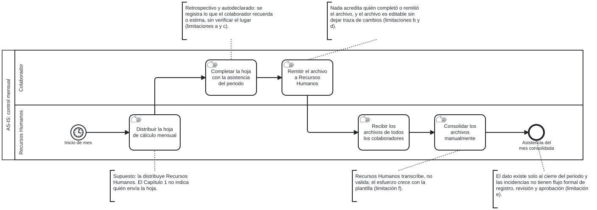
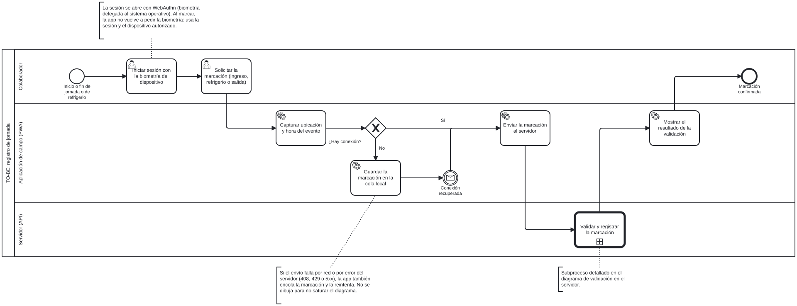
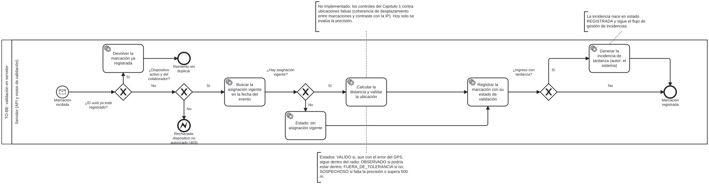
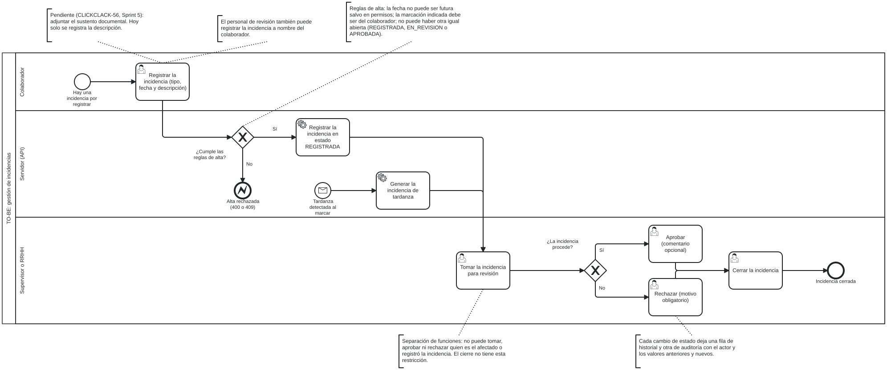

# Modelado de procesos de negocio (BPM)

Modelo del proceso actual (AS-IS) y del proceso propuesto (TO-BE) de ClickClak, en notación **BPMN 2.0**.
Corresponde a CLICKCLACK-63 y al objetivo específico OE1 del Capítulo 1 (modelar el AS-IS y el TO-BE e identificar las actividades manuales que el sistema elimina o automatiza). Es el apartado 5.1 del índice del informe.

Las etiquetas siguen la convención del proyecto: **Requerimiento**, **Supuesto**, **Recomendación**, **Decisión**.

> **De dónde sale cada modelo (declaración de alcance).**
> - **AS-IS:** se construyó solo con la descripción del proceso actual del Capítulo 1 del informe (definición del problema, limitaciones a–f). No se midieron tiempos ni volúmenes y no se contrastó con un responsable del proceso. Lo que el Capítulo 1 no dice se marca como **Supuesto** y no se inventó.
> - **TO-BE:** se construyó leyendo el código del backend y de la aplicación de campo en la rama `feature/frontend-admin-incidencias` (3-oct-2026). Describe lo que el sistema **hace hoy**, no lo que el Capítulo 1 promete. Las diferencias están en la sección 6.
> - Los diagramas se generaron con un script propio y se comprobaron cargándolos en bpmn-js (0 avisos de importación); la lectura visual se hizo sobre el resultado. No se validaron con una herramienta de ejecución BPMN: son modelos de documentación (`isExecutable="false"`).

## 1. Archivos

| Diagrama | Fuente editable | Imagen |
|---|---|---|
| AS-IS: control mensual de asistencia | [as-is-control-mensual.bpmn](bpm/as-is-control-mensual.bpmn) | [SVG](bpm/as-is-control-mensual.svg) |
| TO-BE: registro de jornada | [to-be-marcacion.bpmn](bpm/to-be-marcacion.bpmn) | [SVG](bpm/to-be-marcacion.svg) |
| TO-BE: validación en el servidor | [to-be-validacion.bpmn](bpm/to-be-validacion.bpmn) | [SVG](bpm/to-be-validacion.svg) |
| TO-BE: gestión de incidencias | [to-be-incidencias.bpmn](bpm/to-be-incidencias.bpmn) | [SVG](bpm/to-be-incidencias.svg) |

Los `.bpmn` se abren y editan en cualquier editor BPMN 2.0 (por ejemplo, <https://demo.bpmn.io>). Los SVG se exportaron de esos mismos archivos.

## 2. Proceso actual (AS-IS): control mensual con hoja de cálculo

Participantes: el **colaborador** y **Recursos Humanos**. Todas las actividades son manuales.

| Actividad | Responsable | Fuente |
|---|---|---|
| Distribuir la hoja de cálculo mensual | Recursos Humanos | **Supuesto.** El Capítulo 1 dice que la hoja se distribuye mensualmente, pero no quién la envía. |
| Completar la hoja con la asistencia del periodo | Colaborador | Capítulo 1: cada colaborador la completa; el registro es retrospectivo y autodeclarado. |
| Remitir el archivo a Recursos Humanos | Colaborador | Capítulo 1. |
| Recibir los archivos de todos los colaboradores | Recursos Humanos | Capítulo 1: recibe tantos archivos como colaboradores. |
| Consolidar los archivos manualmente | Recursos Humanos | Capítulo 1: la consolidación es manual y no verificable. |

**Fuera del modelo, por falta de información:**
- El papel de los supervisores en el proceso actual. El Capítulo 1 no lo describe.
- Qué hace Recursos Humanos con el consolidado después (planilla queda fuera de alcance del proyecto).
- Plazos, volúmenes y tiempos reales. No se tienen datos y no se estimaron.
- Cómo se tratan hoy las incidencias. El Capítulo 1 afirma que **no tienen un flujo formal** de registro, sustento, revisión y aprobación; por eso no aparecen como actividades.

### Limitaciones del instrumento (Capítulo 1) y dónde se ven en el modelo

| Limitación | Dónde se aprecia |
|---|---|
| a) Registro retrospectivo | *Completar la hoja con la asistencia del periodo* |
| b) Sin verificación de identidad | *Remitir el archivo* |
| c) Sin verificación de lugar | *Completar la hoja* |
| d) Soporte alterable y sin trazabilidad | *Remitir el archivo* (la hoja viaja editable) |
| e) Latencia y ausencia de gestión de incidencias | Fin del proceso: el dato existe solo al cierre del periodo |
| f) Consolidación manual y no verificable | *Consolidar los archivos manualmente* |

Se describen como limitaciones del **instrumento**, no de las personas: el mecanismo no permite producir la evidencia que se necesita.

## 3. Proceso propuesto (TO-BE): registro de jornada

Participantes: el colaborador, la aplicación de campo (PWA) y el servidor.

1. El colaborador **inicia sesión con la biometría del dispositivo** (WebAuthn, delegada al sistema operativo). La plataforma no almacena datos biométricos.
2. Solicita el tipo de marcación: ingreso, inicio o fin de refrigerio, o salida.
3. La app **captura la ubicación y la hora del evento** en ese instante (no hay rastreo continuo).
4. Si hay conexión, envía la marcación. Si no, la guarda en una **cola local** (IndexedDB) y la envía cuando la conexión se recupera.
5. El servidor **valida y registra** la marcación (diagrama de la sección 4).
6. La app muestra el resultado de la validación al colaborador.

Cada marcación lleva un identificador generado en el cliente (`uuid`), por lo que un reenvío no duplica el registro. Se distingue la hora del evento de la hora de sincronización.

> **Detalle no dibujado.** Si el envío falla por red o por error del servidor (408, 429 o 5xx), la app también encola la marcación y la reintenta. Se omitió del diagrama para no saturarlo.

## 4. Proceso propuesto (TO-BE): validación en el servidor

Es el subproceso *Validar y registrar la marcación* del diagrama anterior. Corresponde a `MarcacionService` y `MotorValidacionContextualService`.

1. **Idempotencia:** si el `uuid` ya está registrado, se devuelve la marcación existente sin duplicarla.
2. **Identidad del dispositivo:** el dispositivo debe estar activo y pertenecer al colaborador; si no, se rechaza (403).
3. **Asignación vigente:** se busca la asignación del colaborador en la fecha del evento. Sin asignación, la marcación se registra con estado `SIN_ASIGNACION`.
4. **Validación contextual:** se calcula la distancia a la ubicación de la asignación y se obtiene un estado **graduado**, no binario:

| Estado | Condición |
|---|---|
| `VALIDO` | Aun sumando el error del GPS, sigue dentro del radio de tolerancia de la ubicación |
| `OBSERVADO` | Podría estar dentro si el GPS se equivocó a su favor; se acepta y se marca para revisión |
| `FUERA_DE_TOLERANCIA` | Ni en el caso más favorable queda dentro del radio |
| `SOSPECHOSO` | Falta la precisión de la lectura o supera 500 m |
| `SIN_ASIGNACION` | El colaborador no tiene asignación vigente |

5. Se registra la marcación con su estado.
6. Si es un **ingreso** con asignación y supera el inicio del horario más su tolerancia, se **genera automáticamente una incidencia de tardanza** (autor: el sistema), que entra al flujo de la sección 5.

> **Supuesto:** los umbrales (500 m de precisión máxima, radio de tolerancia por ubicación, tolerancia por horario) son parámetros de negocio. El propio código los marca como valores iniciales pendientes de calibrar con datos reales de uso.

## 5. Proceso propuesto (TO-BE): gestión de incidencias

Participantes: el colaborador, el servidor y el personal de revisión (supervisores y Recursos Humanos). Corresponde a `IncidenciaService`.

1. **Alta.** La incidencia nace de dos maneras:
   - el colaborador la registra (tipo, fecha y descripción); el personal de revisión también puede registrarla a nombre del colaborador;
   - el motor de validación la genera al detectar una tardanza.
2. **Reglas de alta (manual).** La fecha no puede ser futura salvo en permisos; la marcación indicada debe ser del colaborador; no puede existir otra igual del mismo colaborador, tipo y fecha en estado `REGISTRADA`, `EN_REVISION` o `APROBADA`. Si falla, el alta se rechaza (400 o 409).
3. **Revisión.** El personal de revisión **toma** la incidencia (`EN_REVISION`) y decide: **aprobar** (comentario opcional) o **rechazar** (motivo obligatorio).
4. **Cierre.** Una incidencia aprobada o rechazada se **cierra** (`CERRADA`).

Cada cambio de estado deja una fila de historial y otra de auditoría, con el actor y los valores anteriores y nuevos.

**Separación de funciones.** Nadie puede tomar, aprobar ni rechazar una incidencia que le afecta o que él mismo registró. **El cierre no tiene esta restricción**: así está implementado.

## 6. Comparación AS-IS → TO-BE: qué elimina o automatiza el sistema (OE1)

| Actividad o limitación del AS-IS | En el TO-BE | Efecto | Estado |
|---|---|---|---|
| Completar la hoja con la asistencia del periodo (a: retrospectivo) | La marcación se registra en el instante del evento, con la hora del evento y la de sincronización | **Eliminada** y reemplazada | Implementado |
| Sin verificación de identidad (b) | Inicio de sesión con biometría del dispositivo y dispositivo autorizado y registrado a nombre del colaborador | **Transformada**: la identidad se acredita **por sesión** | Parcial: ver brecha 1 |
| Sin verificación de lugar (c) | Ubicación capturada en el evento y contrastada con la más cercana de las asignaciones vigentes (un técnico puede tener varias sedes a la vez); estado graduado | **Automatizada** | Implementado, sin los controles contra ubicaciones falsas (brecha 2) |
| Soporte alterable y sin trazabilidad (d) | Marcaciones en base de datos, historial de incidencias y bitácora de auditoría con valores anteriores y nuevos | **Eliminada** como riesgo de edición libre | Parcial: la bitácora cubre incidencias y usuarios; las marcaciones no tienen endpoint de edición, pero tampoco se escriben en la bitácora. Ver nota 1 |
| Remitir el archivo a Recursos Humanos | La marcación llega sola al servidor; no hay archivo que enviar | **Eliminada** | Implementado |
| Recibir y consolidar los archivos manualmente (f) | Los datos ya están en la base de datos del sistema | **Eliminada** | Implementado en el almacenamiento; la consulta y los reportes del panel no se modelaron aquí |
| Latencia: el dato existe al cierre del periodo (e) | Disponible en el momento del registro | **Eliminada** | Implementado |
| Incidencias sin flujo formal (e) | Flujo de estados con revisión, aprobación o rechazo, cierre, historial y auditoría | **Creada** (no existía) | Implementado; falta el sustento documental (brecha 3) |
| Tardanza detectada solo al revisar la hoja | Generación automática de la incidencia al marcar con tardanza | **Automatizada** | Implementado |
| Sin conexión no hay cómo registrar | Cola local y sincronización diferida, sin duplicados | **Creada** | Implementado en el cliente y el servidor; la prueba del service worker en Chrome Android está pendiente |

**Nota 1.** `UsuarioService` audita directamente sobre la bitácora y no mediante `AuditoriaService` (ver [diagrama-de-clases.md](diagrama-de-clases.md)); no afecta a estos procesos.

## 7. Brechas entre el TO-BE implementado y lo prometido en el Capítulo 1

Se declaran para que el informe y la sustentación no afirmen más de lo que el sistema hace. Las **Decisiones** son del 3-oct-2026 (Miguel); su aplicación al texto del informe está pendiente (CLICKCLACK-30).

1. **Biometría por sesión, no por marcación.** El objetivo general del Capítulo 1 habla de validar *cada registro* mediante autenticación biométrica, y OE2 de identidad acreditada en cada registro. Hoy la biometría (WebAuthn) se pide al **iniciar sesión** y al registrar el dispositivo; al marcar, la app usa la sesión y el dispositivo autorizado sin pedir la biometría otra vez. **Decisión:** no se exige WebAuthn en cada marcación; el informe se reformula como "identidad acreditada por sesión biométrica y dispositivo autorizado". Queda por cambiar el objetivo general y OE2 del Capítulo 1.
2. **Controles contra ubicaciones falsas.** El Capítulo 1 los presenta como mitigación de la limitación del navegador: coherencia de desplazamiento entre registros consecutivos, patrón de precisión y contraste con la dirección de origen de la solicitud. **No están implementados**: el motor solo evalúa la precisión de la lectura y la distancia. Mientras tanto, la limitación declarada (no se puede detectar un GPS falso desde el navegador) queda **sin mitigar por el servidor**. **Decisión:** no se implementan en el APF2; se declaran como trabajo futuro. Queda por reformular en el Capítulo 1 el párrafo que los presenta como mitigación.
3. **Sustento documental de las incidencias.** OE5 incluye el sustento documental. La entidad de adjuntos existe, pero ningún servicio ni pantalla la usa todavía (CLICKCLACK-56, Sprint 5).
4. **Separación de funciones en el cierre.** El cierre de una incidencia no aplica la restricción de que decida otra persona. **Decisión:** es intencional. Cerrar es un acto administrativo posterior a la decisión de revisión; la separación de funciones se aplica a tomar, aprobar y rechazar.
5. **Modelos sin validar con el proceso real.** El AS-IS no se contrastó con un responsable del proceso, y el TO-BE no incluye aún los flujos de administración (proyectos, ubicaciones, horarios y asignaciones), recuperación de contraseña ni consulta de reportes.

## 8. Cómo regenerar o editar

Los `.bpmn` son la fuente. Para cambiar un diagrama: abrirlo en un editor BPMN, editarlo y exportar de nuevo el SVG con el mismo nombre. Conviene actualizar este documento si cambia el comportamiento descrito, porque los modelos reflejan el código a la fecha indicada.
