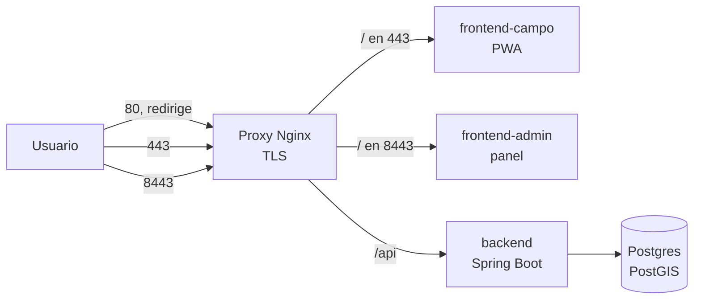

# Despliegue en Azure — VM, costos y operación

> Cap. VII 7.2 del informe (APF2). Describe la infraestructura creada el 2 de octubre de 2026 para el despliegue de la versión 1 (CLICKCLACK-61 y CLICKCLACK-8) y cómo operarla. Los scripts viven en `infra/scripts/`.

## 1. Infraestructura

| Recurso | Valor |
|---|---|
| Suscripción | Azure for Students (tenant de la UTP) |
| Grupo de recursos | `rg-clickclak` |
| Región | **Chile Central** (`chilecentral`) |
| VM | `vm-clickclak`, Ubuntu 24.04 LTS, `Standard_B2als_v2` (2 vCPU AMD, 4 GiB de RAM) |
| Disco | 64 GiB Standard SSD |
| IP pública | `57.156.70.235` (estática) |
| Nombre DNS | `clickclak-utp.chilecentral.cloudapp.azure.com` |
| Puertos abiertos | 22 (SSH), 80 (HTTP), 443 (HTTPS) |
| Software instalado | Docker 29.1.3, Docker Compose 2.40.3, `fail2ban`, 2 GiB de swap |

### Por qué Chile Central

Una política de la universidad restringe la suscripción a cinco regiones: `westus`, `chilecentral`, `northcentralus`, `canadacentral` y `mexicocentral`. Chile Central es la más cercana a Perú entre las que permite, lo que reduce la latencia de los técnicos en campo.

### Por qué ese tamaño

- **Memoria:** se estimó en 2 a 2,5 GiB para el stack completo (dos Postgres, backend, Nginx, Prometheus y Grafana). Medido tras el primer despliegue, con Postgres sin réplica y sin monitoreo todavía, los contenedores suman unos 350 MiB y el sistema usa 1,2 GiB de 3,9 (ver sección 6). 4 GiB alcanzan con holgura.
- **Costo:** la variante de 8 GiB (`B2as_v2`) cuesta el doble y agotaría el crédito antes del cierre del curso.

## 2. Costo

Precios públicos de Azure en USD para Chile Central. Disco e IP son estimaciones, no se pudieron consultar.

| Opción | VM por mes | Total mensual aprox. | Hasta el 13-dic (~72 días) |
|---|---|---|---|
| `B2als_v2` encendida 24/7 | 38,40 | ~47 | ~113 (supera los 100 USD del crédito) |
| **`B2als_v2` ~12 h al día (adoptada)** | ~19 | ~28 | ~67 |
| `B2as_v2` (8 GiB) 24/7 | 76,65 | ~85 | No alcanza |

**Decisión:** el equipo pidió no consumir los 100 USD del crédito. Se adopta la VM de 4 GiB encendida solo en horario de uso, apagada cada noche y con alerta de presupuesto.

**Alerta de presupuesto:** `presupuesto-clickclak`, 35 USD por mes, con aviso por correo al 80 % y al 100 % del gasto real y cuando el pronóstico supere el 100 %.

## 3. Seguridad de la VM

- **Acceso solo por llave SSH** (ed25519). El acceso por contraseña está desactivado y se verificó con `sshd -T`. La llave privada se guarda en el equipo de quien administra y nunca en el repositorio.
- **`fail2ban`** activo contra intentos masivos. El puerto 22 está abierto a cualquier IP porque el equipo se conecta desde lugares distintos; se compensa con la llave y `fail2ban`.
- **Sin credenciales en la VM ni en el repositorio:** el apagado nocturno usa la identidad administrada de la VM, con el rol *Virtual Machine Contributor* limitado a esa misma VM.
- **Pendiente:** TLS con certificado de Let's Encrypt sobre el nombre DNS, cabeceras de seguridad y rate limiting en Nginx (CLICKCLACK-57).

## 4. Apagado nocturno automático

La VM se desasigna cada día a las **23:00 hora de Lima** (04:00 UTC) para dejar de cobrar cómputo. Siguen cobrándose el disco y la IP estática.

Dos decisiones técnicas:

- **No sirve el apagado automático nativo de Azure:** usa el servicio DevTestLab, que no existe en Chile Central.
- **No sirve apagar el sistema operativo desde dentro (`shutdown`):** deja la VM «detenida» y Azure sigue cobrando el cómputo. Solo la **desasignación** lo detiene.

Mecanismo adoptado: `infra/scripts/apagar-vm.sh`, instalado en `/usr/local/bin` y lanzado por cron (`infra/scripts/clickclak-apagado.cron`). El script pide un token a la identidad administrada de la VM y llama a la API de Azure para desasignarla. Se probó de extremo a extremo: Azure aceptó la orden (HTTP 202), la VM pasó a `VM deallocated` y se volvió a encender sin problema.

Para verificar permisos sin apagar nada: `sudo /usr/local/bin/apagar-vm.sh --probar`.

## 5. Operación

**Encender antes de trabajar o de una evaluación** (la IP no cambia):

```powershell
az vm start -g rg-clickclak -n vm-clickclak
```

**Conectarse:**

```powershell
ssh -i $env:USERPROFILE\.ssh\clickclak_azure azureuser@clickclak-utp.chilecentral.cloudapp.azure.com
```

**Ver el estado:**

```powershell
az vm get-instance-view -g rg-clickclak -n vm-clickclak --query "instanceView.statuses[?starts_with(code,'PowerState')].displayStatus | [0]" -o tsv
```

**Apagar a mano** (sin esperar a las 23:00): desde la VM, `sudo /usr/local/bin/apagar-vm.sh`. Apagar solo el sistema operativo no ahorra costo.

> **Recordatorio:** hay que encender la VM antes de cada evaluación o sustentación. Un apagado a las 23:00 no avisa a nadie.

## 6. Despliegue de la aplicación (v1)

El 3 de octubre de 2026 se desplegó el stack completo en la VM con `infra/docker-compose.prod.yml`.



| URL | Qué es |
|---|---|
| `https://clickclak-utp.chilecentral.cloudapp.azure.com/` | App de campo (PWA) |
| `https://clickclak-utp.chilecentral.cloudapp.azure.com:8443/` | Panel administrativo |
| `http://clickclak-utp.chilecentral.cloudapp.azure.com/` | Redirige a HTTPS |

El panel va en un puerto aparte y no en una ruta `/admin` porque el service worker de la PWA, con alcance `/`, interceptaría las navegaciones a `/admin` y serviría la app de campo en su lugar.

### Estado de TLS

El proxy sirve HTTPS con un **certificado autofirmado temporal**, así que el navegador muestra una advertencia. **Pendiente:** emitir el certificado de Let's Encrypt sobre el nombre DNS de Azure. Requiere aceptar los términos de servicio de Let's Encrypt y decidir el correo de contacto para los avisos de vencimiento, y por eso no se hizo automáticamente. Cuando exista, hay que recrear el proxy una vez (`docker compose up -d --force-recreate proxy`); las renovaciones no lo requieren. Las cabeceras de seguridad (HSTS, CSP) y el rate limiting quedan para CLICKCLACK-57, porque HSTS no debe activarse sobre un certificado autofirmado.

### Qué queda expuesto y qué no

- Solo el proxy publica puertos (80, 443 y 8443). Postgres, backend y frontends están en la red interna de Docker.
- Las métricas de Actuator no son públicas: el proxy no enruta `/actuator`, y `/actuator/prometheus` devuelve la página de la app, no métricas.
- Los secretos (`DB_PASSWORD` y `JWT_SECRET`) se generan con `openssl` en la VM, en `infra/.env` con permisos 600. No están en el repositorio.
- En producción no existe la cuenta de desarrollo: la semilla es una migración repetible que solo carga el perfil `dev`. Las migraciones V1 y V2 se aplicaron limpias.

### Primer administrador

`scripts/crear-admin-inicial.sh` crea el usuario `admin@clickclak.local` (rol `RRHH_ADMIN`) con una contraseña aleatoria guardada solo en la VM, en `~/credenciales-admin-inicial.txt` con permisos 600. No se imprime ni se versiona. Hay que cambiarla tras el primer acceso y crear un administrador real desde el panel.

### Procedimiento

Desde la carpeta `infra/` del código copiado a la VM:

```bash
sh scripts/desplegar.sh              # genera secretos si faltan, construye y levanta el stack
sh scripts/crear-admin-inicial.sh    # solo la primera vez
sh scripts/verificar-despliegue.sh   # prueba de humo
```

`desplegar.sh` construye las imágenes de una en una porque compilar el backend y los dos frontends a la vez agotaría la memoria de la VM.

### Verificación

`scripts/verificar-despliegue.sh` ejecuta 17 comprobaciones y las 17 pasaron: los cinco contenedores activos, la redirección 80 → 443, las dos aplicaciones, la API rechazando peticiones sin token (401) y con credenciales malas (401), y un acceso real del administrador con respuesta 200 en `/api/auth/yo`, `/api/incidencias`, `/api/incidencias/mias` y `/api/usuarios`.

### Consumo medido

| Elemento | Valor |
|---|---|
| Backend | 288 MiB |
| Postgres | 51 MiB |
| Nginx (los tres) | ~10 MiB en total |
| Sistema completo | 1,2 GiB usados de 3,9 GiB; swap sin usar |
| Imágenes | backend 409 MB, cada frontend 74 MB |
| Disco | 12 % usado de 61 GB |

Todavía no incluye la réplica de Postgres ni Prometheus y Grafana; se sumarán en CLICKCLACK-60 y CLICKCLACK-13.

### Incidencias durante el despliegue

Insumo para la retrospectiva del Sprint 4:

1. **El build del backend falló con `./mvnw: not found`.** Con `core.autocrlf=true`, Windows entrega los archivos con CRLF y el `
` rompe el shebang. Se agregó `.gitattributes` con LF para scripts, Dockerfile y configuración de contenedores.
2. **El proxy se reiniciaba en bucle con `unknown "ruta_cert" variable`.** El entrypoint de Nginx ignora los archivos `.envsh` sin permiso de ejecución. Se marcó el bit `+x` en git y el script de despliegue lo reafirma.
3. **El script del administrador abortaba en su primera consulta.** `psql -c` no interpola variables; el SQL pasó a la entrada estándar.

### Procedencia del build

Lo desplegado es una integración local de las ramas de los PR #1 a #5, que todavía no están fusionadas en `main`. El despliegue definitivo de la v1 debe hacerse desde `main` una vez fusionados los PR, y etiquetarse `v1-apf2` según CONTRIBUTING.

## 7. Cómo recrearla

Preparación de la suscripción (una sola vez): registrar los proveedores `Microsoft.Compute`, `Microsoft.Network`, `Microsoft.Storage` y `Microsoft.DevTestLab`.

```powershell
az group create -n rg-clickclak -l chilecentral --tags proyecto=clickclak curso=integrador2

az vm create -g rg-clickclak -n vm-clickclak -l chilecentral `
  --image Canonical:ubuntu-24_04-lts:server:latest --size Standard_B2als_v2 `
  --admin-username azureuser --authentication-type ssh --ssh-key-values "$env:USERPROFILE\.ssh\clickclak_azure.pub" `
  --os-disk-size-gb 64 --storage-sku StandardSSD_LRS `
  --public-ip-sku Standard --public-ip-address-allocation static --public-ip-address-dns-name clickclak-utp `
  --nsg-rule SSH

az vm open-port -g rg-clickclak -n vm-clickclak --port 80 --priority 1010
az vm open-port -g rg-clickclak -n vm-clickclak --port 443 --priority 1020

# Identidad administrada con permiso solo sobre esta VM (para el apagado nocturno)
az vm identity assign -g rg-clickclak -n vm-clickclak
az role assignment create --assignee-object-id <principalId> --assignee-principal-type ServicePrincipal `
  --role "Virtual Machine Contributor" --scope <id-de-la-VM>
```

Después, copiar `infra/scripts/` a la VM, ejecutar `sh preparar-vm.sh` (Docker, swap y `fail2ban`) e instalar `apagar-vm.sh` y el cron como se indica en la sección 4.

## 8. Límites conocidos

- **No es alta disponibilidad real.** La réplica de Postgres correrá en esta misma VM: demuestra el mecanismo de replicación (cap. 6.2), pero no protege ante la caída de la VM. Una alta disponibilidad real (cap. 13.2) pediría una segunda VM, que no cabe en el crédito de estudiante.
- **El apagado nocturno es una decisión de costo.** El sistema no está disponible entre las 23:00 y el momento en que alguien la enciende.
- **Cuotas:** 6 vCPU en la región y 10 en la familia de la VM; esta usa 2.
