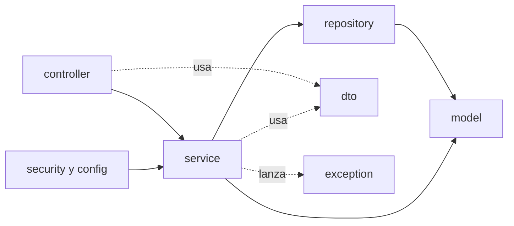
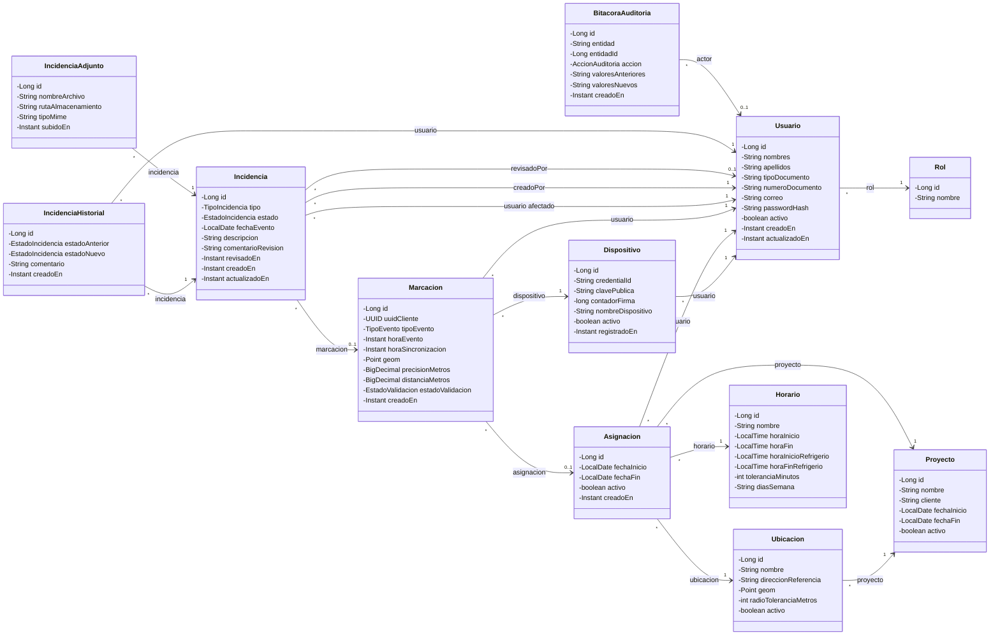
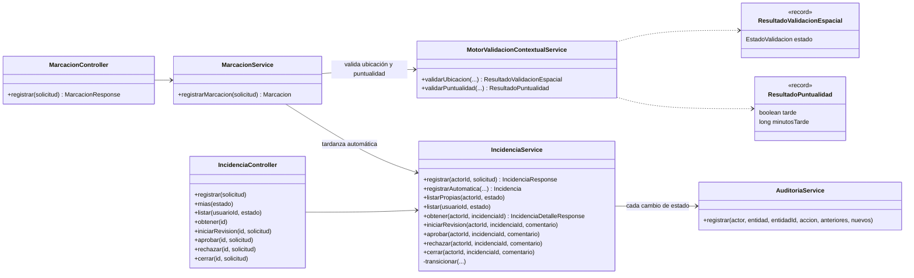
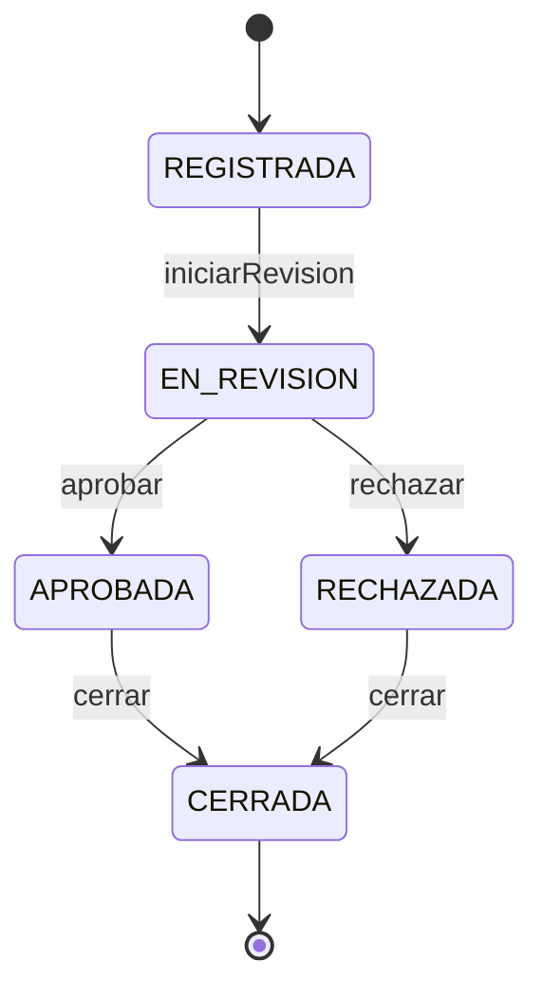
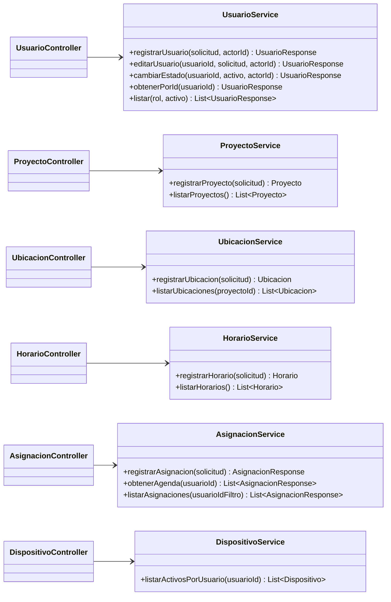
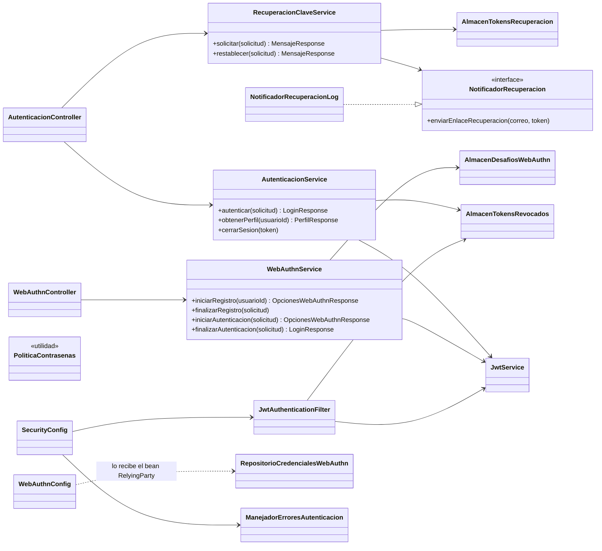

# Diagrama de clases del backend

Documento técnico del backend de ClickClak (Spring Boot, Java 21). Describe las clases reales del paquete `com.clickclak.backend` y cómo se relacionan.
Corresponde a CLICKCLACK-63 (UML) y alimenta la documentación técnica de CLICKCLACK-18.

> **Cómo se elaboró (declaración de alcance).** Los diagramas se redactaron a mano leyendo el código fuente de `backend/src/main/java` en la rama `feature/frontend-admin-incidencias` (3-oct-2026). No se generaron con una herramienta de ingeniería inversa, por lo que **pueden desfasarse si el código cambia**. Se muestran los atributos y métodos relevantes, no todos: los DTO, los repositorios y las excepciones se resumen en tablas.

Las etiquetas siguen la convención del proyecto: **Requerimiento**, **Supuesto**, **Recomendación**, **Decisión**.

## 1. Arquitectura en capas

**Decisión (2-sep-2026):** API REST pura sobre Spring Boot, sin vistas del lado del servidor. El código se organiza en capas, cada una en su paquete.

| Paquete | Clases | Responsabilidad |
|---|---|---|
| `controller` | 10 controladores | Reciben la petición HTTP, validan el formato y delegan en un servicio. No contienen reglas de negocio. |
| `service` | 14 clases y 1 interfaz | Reglas de negocio, transacciones y auditoría. |
| `repository` | 12 interfaces | Acceso a datos con Spring Data JPA. |
| `model` | 12 entidades y 5 enumeraciones | Entidades JPA, que corresponden a las tablas del [diccionario de datos](base-de-datos.md). |
| `dto` | 30 `record` | Contratos de entrada y salida de la API. Las entidades no salen por HTTP. |
| `security` y `config` | 8 + 2 clases | JWT, WebAuthn, tokens revocados y configuración de Spring Security. |
| `exception` | 7 excepciones y 1 manejador | Errores de negocio traducidos a códigos HTTP. |

## 2. Modelo de dominio

Las doce entidades, con sus relaciones; los tipos enumerados se describen en la tabla siguiente. Todas las asociaciones son `@ManyToOne` con carga perezosa (`LAZY`); el lado inverso no está mapeado como colección.

Enumeraciones del paquete `model` (se guardan como texto con `@Enumerated(EnumType.STRING)`):

| Enumeración | Valores | La usa |
|---|---|---|
| `TipoEvento` | `ENTRADA`, `INICIO_REFRIGERIO`, `FIN_REFRIGERIO`, `SALIDA` | `Marcacion` |
| `EstadoValidacion` | `VALIDO`, `OBSERVADO`, `FUERA_DE_TOLERANCIA`, `SOSPECHOSO`, `SIN_ASIGNACION` | `Marcacion` |
| `TipoIncidencia` | `TARDANZA`, `AUSENCIA`, `OLVIDO_REGISTRO`, `PERMISO`, `JUSTIFICACION` | `Incidencia` |
| `EstadoIncidencia` | `REGISTRADA`, `EN_REVISION`, `APROBADA`, `RECHAZADA`, `CERRADA` | `Incidencia`, `IncidenciaHistorial` |
| `AccionAuditoria` | `CREACION`, `MODIFICACION`, `ELIMINACION` | `BitacoraAuditoria` |

> **Verificado y no verificado.** Las cardinalidades `0..1` y `1` salen de `@JoinColumn(nullable = false)` en cada entidad. No se contrastaron contra las restricciones de las migraciones SQL. La fuente de verdad del esquema es el [diccionario de datos](base-de-datos.md).

> **Observación.** `IncidenciaAdjunto` tiene entidad y repositorio, pero **ningún servicio ni controlador la usa todavía**: los adjuntos pertenecen a CLICKCLACK-56 y están planificados para el Sprint 5.

## 3. Núcleo operativo: marcación e incidencias

Es el flujo central del producto: una marcación se valida contra la asignación del colaborador y, si hay tardanza, genera una incidencia de forma automática.

### Reglas que `IncidenciaService` impone

Estas reglas viven en el servicio, no en el controlador (origen: PR #4).

- **Transiciones permitidas** (cualquier otra lanza `TransicionIncidenciaInvalidaException`, que responde 409):

- **Separación de funciones:** nadie puede tomar para revisión, aprobar ni rechazar una incidencia que le afecta o que él mismo registró (`AccessDeniedException`, 403). **El cierre queda fuera de esta restricción**: la comprobación solo aplica a las decisiones de revisión. Además, solo el personal de revisión (supervisores y RRHH) cambia estados.
- **Rechazar exige motivo** (`SolicitudInvalidaException`, 400). Al aprobar o rechazar se guardan juntos quién resolvió, cuándo y el comentario.
- **Sin duplicados abiertos:** no se admite otra incidencia del mismo colaborador, tipo y fecha mientras la primera esté en `REGISTRADA`, `EN_REVISION` o `APROBADA`.
- **Fecha futura:** solo se acepta en permisos.
- **Bloqueo pesimista** (`buscarParaActualizar`) en cada transición.
- **Trazabilidad:** cada cambio escribe una fila en `IncidenciaHistorial` y otra en `BitacoraAuditoria` mediante `AuditoriaService`.

## 4. Administración de datos maestros y asignaciones

Estos servicios no se llaman entre sí: cada uno trabaja directamente con sus repositorios (ver tabla de la sección 6).

## 5. Autenticación y seguridad

Autenticación con JWT en ambos frontends (**decisión 2-sep-2026**) y WebAuthn para la biometría delegada al sistema operativo.

> **Limitaciones declaradas.**
> - `NotificadorRecuperacionLog` solo escribe el enlace de recuperación en el registro: **no envía correo**. Es la implementación de desarrollo de la interfaz `NotificadorRecuperacion`.
> - `AlmacenTokensRevocados`, `AlmacenTokensRecuperacion` y `AlmacenDesafiosWebAuthn` guardan su estado **en memoria** (`ConcurrentHashMap`). Con más de una instancia del backend, o tras reiniciar, ese estado no se comparte ni se conserva. **Supuesto:** con una sola instancia en la VM esto es aceptable para la v1; **Recomendación:** revisarlo antes de cualquier escenario de alta disponibilidad del backend.
> - `RepositorioCredencialesWebAuthn` implementa la interfaz `CredentialRepository` de la librería WebAuthn y se apoya en `UsuarioRepository` y `DispositivoRepository`. `WebAuthnConfig` lo recibe como parámetro al crear el bean `RelyingParty`.

## 6. Repositorios y dependencias de cada servicio

Todos los repositorios extienden `JpaRepository<Entidad, Long>` de la entidad con su mismo nombre. Consultas propias relevantes:

| Repositorio | Consultas propias |
|---|---|
| `AsignacionRepository` | `buscarVigente(usuarioId, fecha)`, `findByUsuarioIdAndActivoTrueOrderByFechaInicioAsc`, `findAllByOrderByFechaInicioDesc` |
| `BitacoraAuditoriaRepository` | `findByEntidadAndEntidadId` |
| `DispositivoRepository` | `findByCredentialId`, `findByUsuarioIdAndActivoTrue` |
| `IncidenciaRepository` | `buscar(usuarioId, estado)`, `buscarParaActualizar(id)` (bloqueo pesimista), `existsByUsuarioIdAndTipoAndFechaEventoAndEstadoIn`, `findByUsuarioId`, `findByEstado` |
| `IncidenciaHistorialRepository` | `findByIncidenciaIdOrderByCreadoEnAsc`, `trazaDe(incidenciaId)` |
| `IncidenciaAdjuntoRepository` | `findByIncidenciaId` |
| `MarcacionRepository` | `findByUuidCliente` (idempotencia de la cola offline), `findByUsuarioIdAndHoraEventoBetween` |
| `RolRepository` | `findByNombre` |
| `UbicacionRepository` | `findByProyectoId` |
| `UsuarioRepository` | `findByCorreo`, `existsByTipoDocumentoAndNumeroDocumento`, `buscar(rol, activo)` |
| `HorarioRepository`, `ProyectoRepository` | Solo los métodos heredados |

Dependencias de cada servicio (constructor):

| Servicio | Repositorios | Otros colaboradores |
|---|---|---|
| `MarcacionService` | Marcacion, Usuario, Dispositivo, Asignacion, Ubicacion | `IncidenciaService`, `MotorValidacionContextualService` |
| `IncidenciaService` | Incidencia, IncidenciaHistorial, Usuario, Marcacion | `AuditoriaService` |
| `AuditoriaService` | BitacoraAuditoria | `ObjectMapper` |
| `MotorValidacionContextualService` | ninguno | ninguno (es una clase de cálculo puro) |
| `UsuarioService` | Usuario, Rol, **BitacoraAuditoria** | `PasswordEncoder`, `ObjectMapper` |
| `AsignacionService` | Asignacion, Usuario, Proyecto, Ubicacion, Horario | ninguno |
| `ProyectoService`, `HorarioService` | su propio repositorio | ninguno |
| `UbicacionService` | Ubicacion, Proyecto | ninguno |
| `DispositivoService` | Dispositivo | ninguno |
| `AutenticacionService` | Usuario | `PasswordEncoder`, `JwtService`, `AlmacenTokensRevocados` |
| `RecuperacionClaveService` | Usuario | `AlmacenTokensRecuperacion`, `NotificadorRecuperacion`, `PasswordEncoder` |
| `WebAuthnService` | Usuario, Dispositivo | `RelyingParty`, `AlmacenDesafiosWebAuthn`, `JwtService` |

> **Hallazgo de diseño (no corregido).** `UsuarioService` escribe en la bitácora directamente con `BitacoraAuditoriaRepository`, mientras que `IncidenciaService` lo hace mediante `AuditoriaService`. Son dos caminos para el mismo fin. **Recomendación:** migrar `UsuarioService` a `AuditoriaService` para tener un único punto de auditoría. No se hizo en este cambio porque modifica código con pruebas existentes y queda fuera del alcance de la documentación.

## 7. Excepciones

`ManejadorGlobalExcepciones` (`@RestControllerAdvice`) traduce las excepciones de negocio, todas hijas de `RuntimeException`, a respuestas HTTP con el cuerpo `{"error": "..."}`:

| Excepción | HTTP | Situación |
|---|---|---|
| `CredencialesInvalidasException` | 401 | Usuario o contraseña incorrectos |
| `DispositivoNoAutorizadoException` | 403 | El dispositivo no está autorizado o fue revocado |
| `RecursoNoEncontradoException` | 404 | El recurso pedido no existe |
| `ConflictoAsignacionException` | 409 | El usuario ya tiene una asignación activa en ese rango de fechas |
| `TransicionIncidenciaInvalidaException` | 409 | Transición de estado fuera del flujo |
| `RecursoDuplicadoException` | 409 | Duplicado de un dato único o de una incidencia abierta |
| `SolicitudInvalidaException` | 400 | Datos que incumplen una regla de negocio |
| `MethodArgumentNotValidException` (de Spring) | 400 | Falla la validación de campos del cuerpo; el mensaje lista `campo: detalle` |

> **Nota.** La falta de permisos por rol (403) no pasa por este manejador: la responde la configuración de seguridad (`ManejadorErroresAutenticacion`).

## 8. Trazabilidad con el resto del proyecto

- **Esquema físico y diccionario de datos:** [base-de-datos.md](base-de-datos.md).
- **Flujo de incidencias** (Registrada → En revisión → Aprobada o Rechazada → Cerrada): definición fijada del producto; implementado en `IncidenciaService` y consumido por la pantalla `/incidencias` del panel.
- **Fuera de este documento:** el diagrama de clases del frontend (React + TypeScript) y el BPM de procesos. El frontend se organiza por componentes y servicios, no por clases, y su descripción corresponde a otro entregable.
