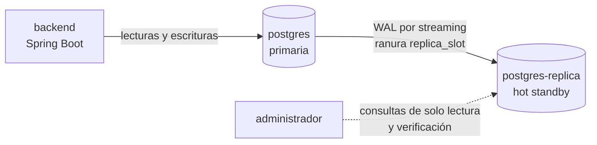

# Replicación y administración de la base de datos

> Cap. VI 6.2 del informe (APF2) · CLICKCLACK-60 y CLICKCLACK-66. Describe cómo replica ClickClak su base PostgreSQL, cómo se administra, cómo se verificó y qué protege y qué no. Probado el 3 de octubre de 2026 en un entorno efímero local y en la VM de Azure.

**Etiquetas:** **Decisión** = adoptada y reflejada en la configuración · **Supuesto** = a validar · **Medido** = con evidencia en este documento · **No probado** = se declara así a propósito.

## 1. Alcance

Hay una réplica en caliente (*hot standby*) de la base de datos, alimentada por replicación en streaming de PostgreSQL. **Corre en la misma VM que la primaria**, por lo que demuestra el mecanismo de replicación y permite promover la réplica si se pierde la base primaria, pero **no protege ante la caída de la VM**. Una alta disponibilidad real (cap. 13.2) exigiría una segunda VM, que no cabe en el crédito de la suscripción de estudiante.

**La replicación no es un respaldo.** Un `DELETE` equivocado o una migración defectuosa se replican a los pocos milisegundos. Los respaldos automáticos son otra historia (CLICKCLACK-14) y todavía no existen.

## 2. Topología



- **La aplicación solo usa la primaria.** No se separan lecturas y escrituras: la carga actual no lo justifica y habría que resolver la lectura de datos atrasados.
- **La réplica no se publica fuera de la red de Docker.** Ningún puerto del host llega a ella.
- Las migraciones de Flyway se aplican en la primaria y llegan a la réplica por el mismo WAL; no hay que ejecutarlas dos veces.

## 3. Configuración

| Parámetro | Primaria | Réplica | Por qué |
|---|---|---|---|
| `wal_level` | `replica` | — | Nivel mínimo que permite replicar |
| `max_wal_senders` | 5 | 5 | La réplica exige un valor igual o mayor que el de la primaria |
| `max_replication_slots` | 2 | 2 | Igual |
| `max_connections` | 50 | 50 | Igual; la réplica no arranca si es menor |
| `max_slot_wal_keep_size` | 2 GiB | — | Tope del WAL que la ranura retiene si la réplica está caída; sin él, una réplica parada llenaría el disco |
| `hot_standby` | — | `on` | La réplica acepta lecturas |
| `shared_buffers` | 128 MB | 64 MB | Acotado por los 4 GiB de la VM |

**Decisión: replicación asíncrona.** Una réplica síncrona obligaría a la primaria a esperar la confirmación en cada transacción y la dejaría bloqueada si la réplica cae. Con una sola VM, esa dependencia solo añade riesgo. El costo: ante una pérdida repentina de la primaria, las últimas transacciones aún no replicadas pueden perderse.

**Decisión: ranura de replicación física (`replica_slot`).** Garantiza que la primaria no descarte el WAL que la réplica todavía no leyó, de modo que la réplica retoma donde se quedó tras una caída corta.

## 4. Seguridad

- **Rol `replicador`:** solo tiene los permisos `REPLICATION` y `LOGIN`. Su contraseña (`REPLICA_PASSWORD`) se genera con `openssl` en la VM, vive en `infra/.env` con permisos 600 y se reasigna en cada despliegue, así que rotarla es cambiar el valor y volver a desplegar.
- **No puede entrar a la base de la aplicación.** La regla por defecto de la imagen (`host all all all`) le habría permitido conectarse y ver los nombres de las tablas, aunque no leer sus datos. Se detectó al probarlo y se corrigió retirando `CONNECT` a `PUBLIC`: la replicación no lo necesita y la aplicación entra como propietaria. Queda comprobado en cada verificación.
- **Regla de `pg_hba.conf`:** `host replication replicador samenet scram-sha-256`. Solo acepta conexiones de replicación desde la misma subred de Docker y con contraseña cifrada con SCRAM.
- **Riesgo conocido:** la copia inicial deja la conexión a la primaria, contraseña incluida, en `postgresql.auto.conf` del volumen de la réplica. Ese archivo tiene permisos 600 y solo es legible dentro del contenedor. Se acepta para esta versión.
- **Sin TLS entre la réplica y la primaria**, igual que el resto del tráfico interno: comparten host y red de Docker.

## 5. Cómo se despliega

`infra/scripts/desplegar.sh` hace, en orden:

1. Agrega `REPLICA_PASSWORD` a `infra/.env` si falta, sin tocar los demás secretos.
2. Levanta la primaria y espera a que esté sana.
3. Ejecuta `infra/postgres/replicacion/preparar-primaria.sh` dentro de ella: crea el rol `replicador`, la ranura `replica_slot`, la regla de `pg_hba.conf` y retira `CONNECT` a `PUBLIC`. Es **idempotente** y funciona sobre una base con datos. No se usó un script de `/docker-entrypoint-initdb.d` porque esos solo corren al inicializar un volumen vacío, y la primaria de producción ya existía.
4. Levanta el resto. La réplica (`infra/postgres/replicacion/entrada-replica.sh`) copia la primaria con `pg_basebackup` la primera vez y arranca directamente las siguientes. Si la primaria aún no admite la copia, reintenta hasta 40 veces.

## 6. Administración

**Verificar el estado** (no destructivo; crea y borra una tabla temporal):

```bash
sh scripts/verificar-replicacion.sh
```

**Consultas útiles** desde la VM (`sudo docker exec clickclak-postgres-1 psql -U clickclak -d clickclak -c "..."`):

| Qué | Consulta |
|---|---|
| Estado de la conexión y retraso | `SELECT state, sync_state, replay_lag FROM pg_stat_replication` |
| Retraso en bytes | `SELECT pg_wal_lsn_diff(sent_lsn, replay_lsn) FROM pg_stat_replication` |
| Ranura y WAL retenido | `SELECT slot_name, active, pg_size_pretty(pg_wal_lsn_diff(pg_current_wal_lsn(), restart_lsn)) FROM pg_replication_slots` |
| ¿Es réplica? (en cada servidor) | `SELECT pg_is_in_recovery()` |

**Migraciones:** se ejecutan al arrancar el backend, contra la primaria. **Usuarios y permisos:** `clickclak` es el propietario y lo usa la aplicación; `replicador` solo replica. **Respaldos:** pendientes (CLICKCLACK-14).

## 7. Procedimientos

### 7.1 La réplica se cae o se reinicia

No requiere acción. La ranura conserva el WAL que falta y la réplica lo recupera al volver. Si estuvo caída tanto tiempo que el WAL retenido superó los 2 GiB, la ranura se invalida y hay que reconstruir la réplica (7.2).

### 7.2 Reconstruir la réplica desde cero

```bash
cd ~/clickclak/infra
COMPOSE="sudo docker compose -f docker-compose.prod.yml --env-file .env"
$COMPOSE stop postgres-replica && $COMPOSE rm -f postgres-replica
sudo docker volume rm clickclak_postgres_replica_data
sh scripts/desplegar.sh
```

### 7.3 Promover la réplica (pérdida de la primaria)

> **Estado de prueba:** la promoción de la base se probó y se midió (sección 8). El cambio de la aplicación a la base promovida **no se probó de extremo a extremo**.

1. **Confirmar que la primaria de verdad no responde.** Promover con la primaria viva crea dos bases que aceptan escrituras y los datos divergen.
2. **Cercar la primaria** para que no vuelva a escribir:
   `$COMPOSE stop postgres`
3. **Promover la réplica:**
   `$COMPOSE exec -T postgres-replica psql -U clickclak -d clickclak -c "SELECT pg_promote(wait_seconds => 30)"`
4. **Apuntar el backend a la base promovida.** Agregar `DB_HOST=postgres-replica` a `infra/.env` y recrear el backend **sin dependencias**, porque `depends_on` volvería a arrancar la primaria detenida:
   `$COMPOSE up -d --no-deps backend`
5. **Verificar:** `sh scripts/verificar-despliegue.sh` fallará en las comprobaciones de la primaria detenida y de la replicación (ya no hay réplica), pero el login del administrador y la API deben responder.

**Después de promover, no ejecutar `desplegar.sh`:** levantaría de nuevo la primaria antigua. Recuperar la redundancia exige construir una réplica nueva a partir de la base promovida, lo que con esta topología obliga a intercambiar los servicios y volúmenes. Eso no está automatizado ni probado y queda como trabajo futuro del plan de recuperación ante desastres (cap. 13).

## 8. Evidencia

### 8.1 Producción (VM de Azure)

`scripts/verificar-replicacion.sh`, **12 comprobaciones, las 12 correctas**, integradas en `verificar-despliegue.sh` (**52 comprobaciones en total, todas correctas**):

| Comprobación | Resultado |
|---|---|
| La primaria no está en modo réplica | `f` |
| La réplica está conectada, en streaming y con el rol `replicador` | `streaming` |
| La ranura `replica_slot` está activa | `t` (tipo físico) |
| Retraso de la réplica | 0 bytes (límite de la prueba: 1 MiB) |
| La réplica está en modo recuperación y tiene PostGIS | `t` · `postgis` |
| La réplica rechaza escrituras | rechazada |
| El rol `replicador` no entra a la base de la aplicación | denegado |
| Una contraseña incorrecta no puede replicar | rechazada |
| Una escritura en la primaria aparece en la réplica | aparece |
| Mismos roles de la aplicación en ambas bases | 3 y 3 |

Otros datos medidos: la réplica ve las migraciones V1 y V2 y el usuario administrador, la replicación es asíncrona, la base pesa 20 MB, la réplica consume unos 20 MiB de memoria, la primaria unos 41 MiB y el sistema sigue en 1,2 GiB usados de 3,9 con el swap sin tocar.

### 8.2 Escenarios destructivos (entorno efímero local)

Se probaron con los mismos scripts y el mismo compose, en un proyecto de Docker aparte que se eliminó al terminar. **No se ejecutaron en producción.**

| Escenario | Resultado |
|---|---|
| La réplica se detiene y la primaria escribe 5000 filas | La ranura conservó 318 kB de WAL; al volver, la réplica alcanzó las 5000 filas y retomó el streaming |
| Reconstruir la réplica con el volumen borrado | 7 segundos; copió las 5000 filas y quedó en recuperación |
| Detener la primaria y promover la réplica | Promovida en **590 ms**; acepta escrituras; las 5000 filas previas intactas |

## 9. Objetivos de recuperación

| Objetivo | Valor | Estado |
|---|---|---|
| **RPO** (datos que se pueden perder) | Cercano a 0 con la réplica al día (retraso de 0 bytes en reposo), pero **no garantizado**: es asíncrona y una pérdida repentina puede perder las últimas transacciones | Medido en reposo; no bajo carga |
| **RTO** (tiempo para volver a operar) | La promoción de la base tarda menos de un segundo, pero el RTO real incluye detectar la caída y ejecutar los pasos manuales de 7.3 | **No medido de extremo a extremo** |
| Protección ante la caída de la VM | **Ninguna**: primaria y réplica comparten VM y disco | Limitación declarada |

## 10. Lo que se descubrió al construirla

Insumo para la retrospectiva del Sprint 4:

1. **Un permiso por defecto que no debía existir.** La afirmación del propio script («el rol no puede conectarse a la base de la aplicación») era falsa hasta que se probó.
2. **Una prueba que no medía nada.** La comprobación «mismos roles en ambas bases» daba OK comparando dos mensajes de error idénticos, porque la tabla no existía en el entorno de prueba. Ahora exige un valor numérico y se omite de forma explícita si no existe.
3. **`\gexec` ejecuta como SQL el resultado de la consulta.** Sirve para generar un `CREATE ROLE`, pero no para llamar a una función que devuelve una fila.

## 11. Pendientes

1. Respaldos automáticos y restauración probada (CLICKCLACK-14).
2. Alerta por retraso o desconexión de la réplica, en el monitoreo (CLICKCLACK-13).
3. Probar la promoción de extremo a extremo con la aplicación y medir el RTO real.
4. Una segunda VM para alta disponibilidad real, si el presupuesto lo permite.
